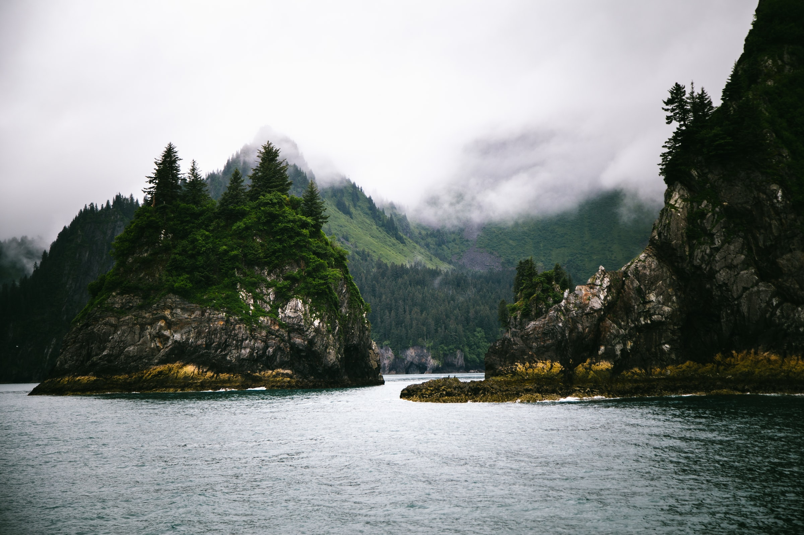
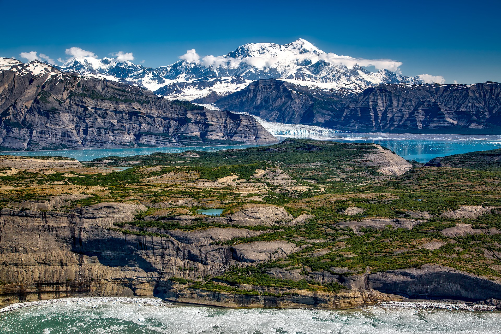

Being the largest state in the nation, it comes to no surprise that Alaska has 8 national parks that are full of the most jaw dropping landscapes on Earth, these are also the best places to visit in Alaska. What surprises most people is the mind blowing vast amounts of land that these parks cover. The size of Wrangell-St Elias National Park alone, is the size of Yellowstone National Park, Yosemite National Park, and Switzerland compbined! 

To visit all of the national parks in Alaska you need to be prepared to put on your hiking boots, fly in a seaplane, and ride on a few boats because half of the national parks in Alaska don't even have roads leading to them because they are so remote.

## What are the national parks in Alaska?
The national parks in Alaska are tens of millions of acres of some of the most beautiful, pristine, and jaw dropping landscapes on Earth. They include vast wildernesses, hundereds of glaciers, islands, volcanoes, salmon runs, grizly bears, and of the highest mountain in North America, Mount Denali.

Alaska's national parks are with out a doubt the best places to visit in Alaska. They hold the epic and jaw dropping landscapes that we've always seen on the Discovery Channel and National Geographic. After a trip to these parks, you'll know why they call it "the last frontier".

\
**These are the national parks in Alaska:**

### 1. Glacier Bay National Park

Glacier Bay National Park is the most visited national park in Alaska with over 800,000 anual visitors. Located just outside of Juneau, Glacier Bay is one of the crown jules of the national park system.

### 2. Denali National Park

Home to Mount Denali, the highest mountain in North America with a summit elevation of 20,146, this park attracts everyone especially mountaineers.

### 3. Kenai Fjords National Park

Kenai Fjords national park is a dramatic landscape that might be able to give us a glimpse of what it looked like to be alive during the ice age. Covered with over 40 glaciers and year-round snow pack, it's time to get the snow shoes out.

### 4. Katmai National Park

Katmai National Park is where the popular photos are taken of grizly bears eating fish jumping out of the river. Located on the northwest end of Kodiak Island, visitors mush take a boat or plane to witness this amazing site.

### 5. Wrangell-St. Elias National Park

Home to some of the most dramatic elevation change in the country, going from sea level to 18,008 ft, Wrangell-St. Elias National Park is a must see. Larger than Yellowstone, Yosemite, and Switzerland combinded, be sure to bring your map.

### 6. Lake Clark National Park

Lake Clark National Park is home to some of the most stunning views in all of Alaska. With vast landscapes of picture perfect mountains and lakes, this is every photographer's paradise.

### 7. Kobuk Valley National Park

Mostly known for the half million caribou that migrate through this park each year, Kobuk Valley National Park is one of the most lively national parks in Alaska. Covered with sand dunes, rivers, forests, and mountains there is something here to spark the explorer in everyone.

### 8. Gates of the Arctic National Park

With no roads or trails and being in the Arctic Circle, it should be no surprise that Gates of the Arctic National Park is the least visited national park in the United States. With just over 10,000 anual visitors, this truly is the last frontier.