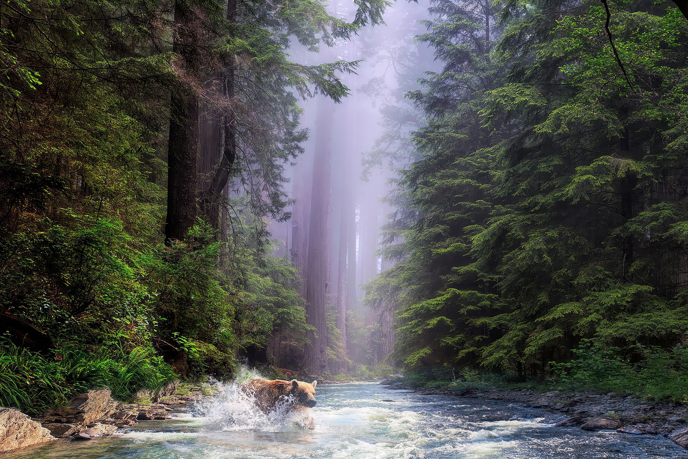

The 9 national parks in California include some of the most diverse and incredible landscapes on Earth. No place on Earth compares to what the California national parks can offer. 

## What are the national parks in California?

The California national parks are volcanoes, islands, forests, deserts, granite walls, and much more. They include both the highest and lowest point in the continental US, as well as the best places to visit in California.

To experience it all, you need to be prepared for road trips, boat rides, and a lot of hiking. These parks include some of the most accessible and inaccessible nature in the country.

\
**These are the national parks in California:**

### 1. Yosemite National Park

Yosemite is with out a doubt the most popular national park in California and one of the most popular in the United States with over 4 million anual visitors. Towering granite walls, massive water falls, and lush forests, Yosemite has some incredible nature for just about anyone.

### 2. Joshua Tree National Park

Just a few hours outside of Los Angeles, it's not a surpise that Joshua Tree National Park is the 2nd most popular national park in california. Known for and named after the other worldly Joshua Trees that thrive throughout the park and can't be found anywheres else on Earth.

### 3. Death Valley National Park

Reaching an elevation as low as 282 feet below sea level, it's not a surprise that this is the lowest point in the USA.

### 4. Sequoia National Park

Home to some of the largest trees on Earth, Sequoia National Park can inspire just about anyone. Some of the trees are over 3,000 years old.

### 5. Kings Canyon National Park

Home to the deepest canyon at over a mile and half deep, Kings Canyon National Park is deffinitely a unique spot in America.

### 6. Lassen Volcanic National Park

Often conssidered a mini Yellowstone, Lassen Volcanic national park offers hot springs and geysers that are hard to find anywhere outside of Yellowstone.
<!-- ### 6. Lassen Volcanic National Park
 -->

### 7. Redwood National Park

Redwood National Park and the neighboring state parks protect the largest remaining area of Coastal Redwoods in the world.

### 8. Channel Islands National Park

Consisting of 5 of the 8 islands in the Chanel Islands, Channel Islands National Park is a beautiful slice of California. You need to take a boat from Ventura to get out to this paradise, but once you are there you essentially have the whole place to your self.

### 9. Pinnacles National Park

Just over a 2 hour drive from downtown San Francisco, it's a surprise to most people that Pinncales National Park is one of the least visited parks in the US. With just under 200,000 visitors a year, this is a great place to escape the hussle and bussle of the city.