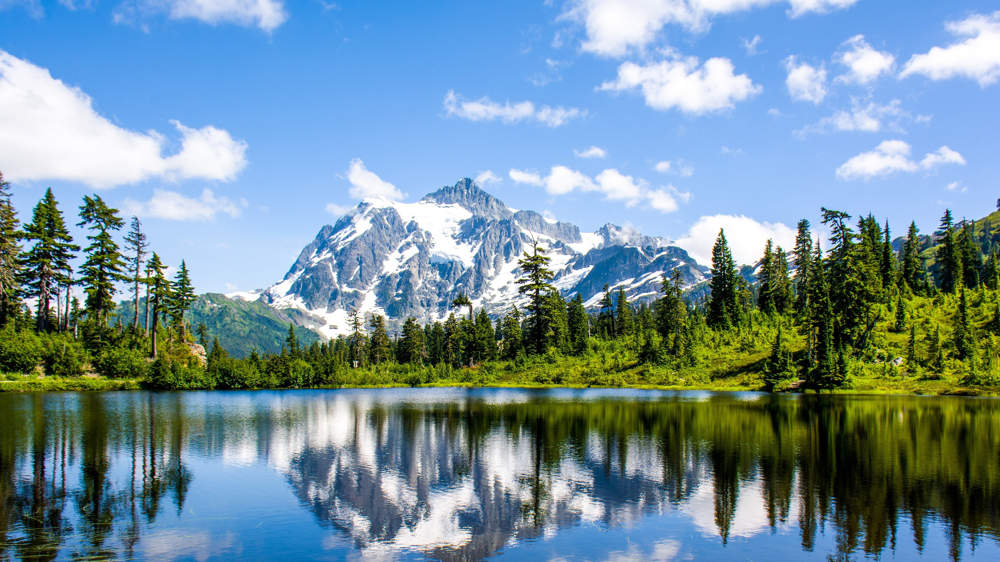
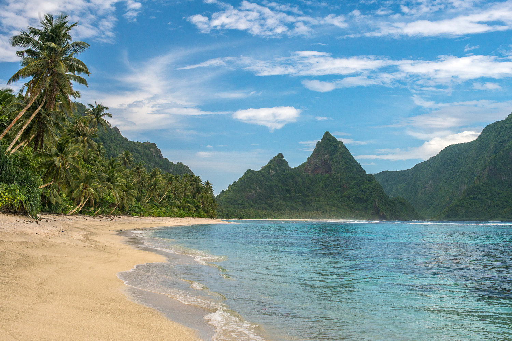

After visiting places such as Yosemite, Yellowstone, and Rocky Mountain National Park, at some point you've probably wandered if all of the national parks are this crowded. The answer is no, several of the least visited national parks have less visitors annually than your local Walmart has in a few days.

Several of the least national parks in the united states are so remote that they don't even have roads leading to them, where others are just a few hours outside some of the largest cities in the country, such as San Francisco.

## What are the national parks in California?
The least visited national parks in the United States are vast tundras, large islands, and remote wildernesses. 

Some of these parks can be accessed by a 2 hour drive from San Francisco or Seattle, while others require a substantial amount of planning as well as a boat or plane ride.

**These are the least visited national parks in the United States:**

### 1. Gates of the Arctic

**Anual Visitors:** 10,518\
**Nearest Town:** Fairbanks, AK

With no roads leading into the park it's no surprise that Gates Of The Arctic National Park is the least visited national park in the United States. On average this park will see less visitors in a year than your local Walmart will see in a few days.

 

### 2. Kobuk Valley

**Anual Visitors:** 15,766\
**Nearest Town:** Kotzebue, AK

Similar to Gates Of The Arctic, Kobuk Valley National Park has no roads leading into the park and the only way to visit the park is by air taxi or walking.

 

### 3. Lake Clark

**Anual Visitors:** 17,157\
**Nearest Town:** Port Alsworth, AK

Being a remote national park in Alaska, it's no surpise that there are no roads leading to this park eith.

 

### 4. Isle Royale

**Anual Visitors:** 26,410\
**Nearest Town:** Grand Portage, MI

Being an island in the middle of Lake Superior, you must take a boat or seaplane.
<iframe src="//rcm-na.amazon-adsystem.com/e/cm?o=1&p=26&l=ur1&category=outdoorrecreation&banner=0CDY3FGJ2PD68NJXFKG2&f=ifr&linkID=7913cbfcf978ea06609e86e10d8675f9&t=epicnationalp-20&tracking_id=epicnationalp-20" width="100%" height="60" scrolling="no" border="0" marginwidth="0" style="border:none;" frameborder="0"></iframe>

### 5. North Cascades

**Anual Visitors:** 38,208\
**Nearest Town:** Whatcom, WA

At just over a 2 hour drive from downtown Seattle, it's pleasantly shocking to see such a beautiful park have so few visitors.

 

### 6. National Park of American Samoa

**Anual Visitors:** 60,006\
**Nearest Town:** Atuu, AS

Being the only US National Park located on a continent other than North America, it makes sense that this park doesn't see much traffic.

 

### 7. Wrangell-St. Elias

**Anual Visitors:** 74,518\
**Nearest Town:** Copper Center, AK

A remote Alaskan National Park.

 

### 8. Dry Tortugas

**Anual Visitors:** 79,200\
**Nearest Town:** Fort Jefferson, FL

Being an island 70 miles south of Key West, Florida, we were not surprised that Dry Tortugas National Park saw less than 80,000 visitors in 2019.

 

### 9. Katmai

**Anual Visitors:** 84,167\
**Nearest Town:** King Salmon, AK

We've all seen the pictures of grizly bears eating salmon out of the river in Alaska, this is where these photos are taken.

 

### 10. Great Basin

**Anual Visitors:** 131,802\
**Nearest Town:** Wine Pine, NV

Being on the Nevada/Utah border (A.K.A the middle of no where), might be why Great Basin National Park is one of the 10 least visited national parks in the US.

 

### 11. Virgin Islands

**Anual Visitors:** 133,398\
**Nearest Town:** St John, VI

The fact that this national park is on an island is probably why it's one of the least visited.

 

### 12. Congaree

**Anual Visitors:** 159,445\
**Nearest Town:** Hopkins, SC

Perhaps the relatively small amount of traffic this park recieves is the reason why it boasts the largest tract of old growth bottomland hardwood forest in the United States.

 

### 13. Pinnacles

**Anual Visitors:** 177,224\
**Nearest Town:** Paicines, CA

Being just over a 2 hour drive from San Francisco, we were pleasently surprised that this national park and a California national park in general is one of the least visited national parks in the United States.

 