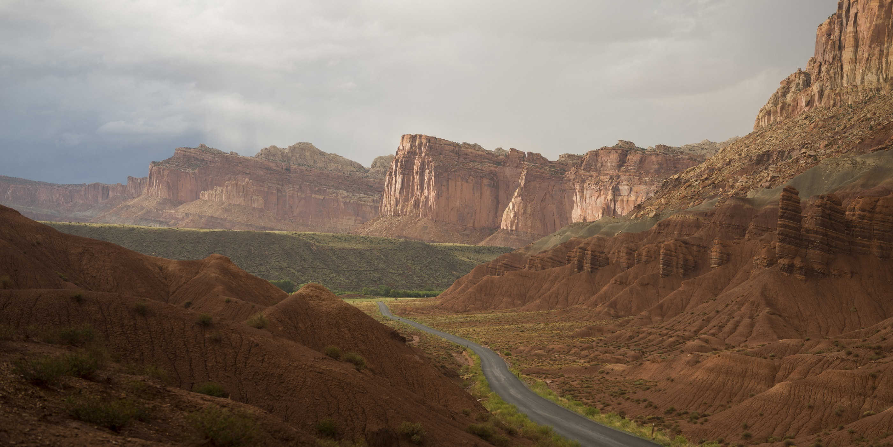

The 5 Utah natioanl parks are the best places to visit in Utah. They are home to some of the most beautiful and dramatic landscapes in the entire United States. A road trip to visit them all is a popular summer vacation for many Americans.

To visit all of the national parks in Utah be prepared for long road trips, lots of hiking, and of course bring a map. Every year people get lost in the vast canyon networks that make up the national parks in Utah.

## What are the national parks in Utah?
The national parks in Utah are millions of acres of vast wilderness, extensive networks of narrow canyons, hundereds of stone arches, and of course red rocks. A trip to the national parks in utah gives us a glimpse of what the Earth may of looked like millions of years ago.

These Utah national parks are without a doubt the best places to visit in Utah.

\
**These are the national parks in Utah:**

### 1. Zion National Park

Zion National Park is the crown jewel of the national parks in Utah. It's made up of an extensive network of both narrow and wide canyons. "The Narrows", a network of narrow canyons only 15 feet wide in someplaces, is by far the most popular attraction at Zion National Park.
 
<a target="_blank" href="https://www.amazon.com/gp/product/1566952972/ref=as_li_tl?ie=UTF8&camp=1789&creative=9325&creativeASIN=1566952972&linkCode=as2&tag=epicnationalp-20&linkId=d34ce0933d1cb6440163fa4a6d9eab5b">Zion National Park (National Geographic Trails Illustrated Map, 214)</a>

### 2. Bryce Canyon National Park

Bryce Canyon National Park is made up of a series of various plateaus and rock formations. There is no shortage of towering pinnacles throughout the park.

### 3. Arches National Park

Arches National Park is loaded with over 2,000 natural stone arches and hundereds of pinnacles. There really is no other place like it in the world. Compared to the rest of Utah's national parks, Arches is relatively small and can easily be covered in a single day.

### 4. Capitol Reef National Park

A visit to Capitol Reef National Park in Utah is a trip back in time. The park is made up of rolling landscapes, high plateaus, and vast canyons. One would almost expect to see a dinosaur or two.

### 5. Canyonlands National Park

Canyonlands National Park, the largest of the national parks in Utah, is so large that it's actually slit into 3 smaller parks that are only connected internally by 4x4 dirt roads and hiking trails.
