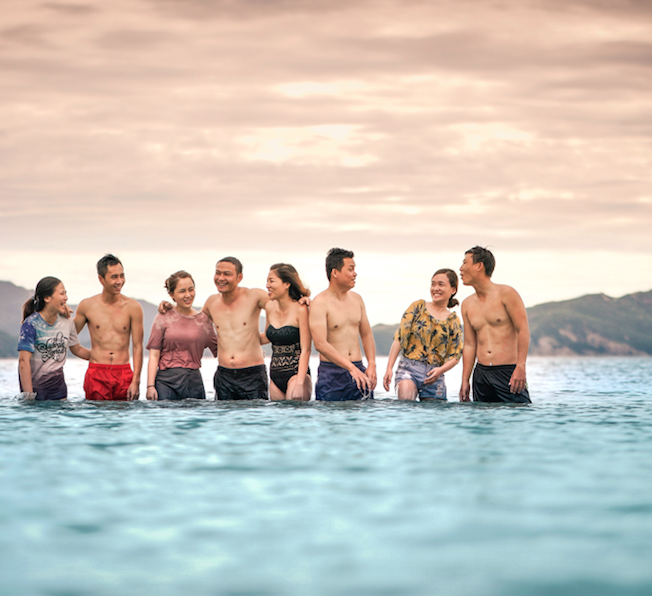

Do you feel like something’s missing in your life? The answer could be found in the total full-body relaxation that comes with soaking in a hot tub spa. We’ve compiled a list of some of the core benefits to adding the exceptional experience of soaking in a hot tub spa into your daily relaxation routine. 

**These are the benefits of owning a hot tub spa:**

### 1. Improved Mood

We all have bad days, but when you have that evening soak to look forward to it has the power to magically transform your day. It is impossible to be irritated when you’re soaking in a warm body of water with strategically placed jets delivering hydrotherapy to your sore muscles. Improved mood is a big benefit to soaking in a hot tub spa. Plus people will like being around you more when you’re in a good mood. 

### 2. Improved Sleep

A staggering 68% of Americans <a href="https://www.consumerreports.org/sleep/why-americans-cant-sleep/">have trouble getting a good night’s sleep.</a> Soaking in a warm body of water before bed helps to relax your body and quiet your mind. A warm soak can set the stage for a restful night’s sleep, which in turn makes you have more enjoyable days. Add a few drops of lavender oil to your spa water for added enjoyment and relaxation. 

### 3. Less Anxiety

Anxiety affects so many of us and can have long-term consequences if not addressed. It’s helpful to become more aware of your body (a get-out-of-your-head-and-into-your-body approach) to remedy those most anxious moments. Soaking in water brings awareness to the body and is a natural way to clear your mind. And when the body is relaxed, the levels of cortisol (the stress hormone) are reduced. Wind down with a soak and feel the difference. 

### 4. Pain Free Living

Back and shoulder pain are prominent places most of us hold tension. But physical pain or discomfort can occur anywhere in the body after a long day of repeated movements and stressful environments. Water offers a zero-gravity environment that relieves stress on the joints. Hydrotherapy massage helps the body to release stored tension in tight muscles and encourages better circulation throughout the body. Hot tub spas feature jets to target the sore muscles that need relaxation the most. <a href="https://www.ncbi.nlm.nih.gov/pmc/articles/PMC3091428/">This study</a> reported that regular massage had a “significant reduction in pain levels” for patients. A regular hydrotherapy massage routine can make all the difference. 

### 5. Better Quality of Life

Measured by many factors, a hot tub spa can improve your quality of life by giving you a stress free relaxing experience every time you use it. It’s an investment in self-care and full-body wellness. Targeted hydrotherapy jets offer relief to sore muscles, heated water helps to improve circulation and lower blood pressure, and all of these factors contribute to physical and mental relaxation and an improved sense of well being.

### 6. Clear Skin

Often skin issues are caused by oil and dirt build-up in pores. A hot water soak opens pores and releases impurities out of the body, naturally clearing the skin. Sweat is the body’s natural clearing and cooling process. As the body sweats in the hot tub spa, toxins are released. It is best practice to shower with soap before your soak in the hot tub spa to ensure that your skin is clean during the hot tub spa detox session.

### 7. More Friends

Party at your place? You bet. When your neighbors and friends hear about your new hot tub spa they will most likely want to join you for a relaxing soak. The more the merrier! It’s a great way to create a stress-free experience with your favorite people.

With so many benefits to welcoming the relaxation that comes with having your very own hot tub spa, what better time than now to invest in a better life for yourself!? Interested in knowing your hot tub options? We would love to learn more about what you’re looking for and help find the perfect spa for you!

Reach out to Spa Lady Kate herself at: spaladykate@gmail.com + 970.825.0777

