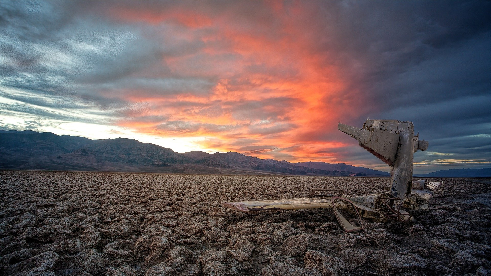

The 9 national parks in California are home to some of the most diverse and incredible landscapes on Earth and are by far the best places to visit in California. The national parks are spread out across this large state with some being much more accessible than others. Many of the sites and natural features are world renowned and iconic around the globe.

Many people organize their entire summer vacation around visiting California's national parks and because of the incredible nature that can be found in each park, one could easily spend their entire vacation in just a single park. 

## What are the national parks in California?

The California national parks are volcanoes, islands, forests, deserts, granite walls, and much more. They are full of record breaking natural features, including both the highest and lowest elevations in the continental US, the tallest trees in the world, and the largest plug dome volcano in the world.

To experience it all, you need to be prepared for road trips, boat rides, and of course a lot of hiking. While some of the parks are just a few hours drive outside of some of the major cities, others such as Channel Islands National Park is only accessible by a ferry. 

**These are the national parks in California:**

### 1. Yosemite National Park

Yosemite is the most popular national park in California and one of the most popular in the United States with over 4 million anual visitors. There's no question why this park is so popular, it's full of some of the most majestic landscapes on Earth. From towering granite walls to lush forests and powerful waterfalls, it doesn't take long to realize why so many people travel here each year.

If you're planning on making your trip to Yosemite National Park a camping trip, be sure to book well in advance. These camping spots are some of the most in demand caping spots in the country with most booking up within days and hours of becoming available.

<a href="https://amzn.to/3ln1eUf" target="_blank" rel="noopener noreferrer">Yosemite National Park Map<a>

### 2. Joshua Tree National Park

Just a few hours east of Los Angeles, Joshua Tree National Park is the "escape to nature" for most Angelenos. It's also conviniently located just outside the town of Indio, which is home to the world famous Coechella music festival. Named after the famous Joshua Trees that thrive throughout the park, Joshua Tree National Park is one of the best places to visit in California.

Although most people make a day trip to Joshua Tree National Park, camping out and stargazing is perhaps one of the most memorable and inspiring experiences that one can have at Joshua Tree. The park is home to some of the most clear night skies in all of California and as you lie beneath the incredible Milky Way, you'll be able to count an infinit number of reasons to come back in the future.

<a href="https://amzn.to/3d27PAi" target="_blank" rel="noopener noreferrer">Joshua Tree National Park Map<a>

### 3. Death Valley National Park

Reaching an elevation as low as 282 feet below sea level, it's no surprise that Death Valley National Park is where the hottest temperature has ever been recorded on Earth. A scorching 134 °F was recorded here in Furnace Creek on July 10th, 1913. What is a surprise is that Death Valley National Parks is among one of the most visited national parks in the country with over 1.7 million visitors in 2019 alone. Perhaps the most mind boggling part is that Badwater Basin, the lowest part of the park, sits just 85 miles as the crow flies from the summit of Mt. Whitney, the highest point in the continental US.

Death Valley National Park is no joke, be sure to bring excessive amounts of water with you while hiking and even driving. The heat can sneak up on you and causes several heat strokes every year. With propper planning and preparation, Death Valley National Park will be one of the most unforgettable places you'll ever travel to.

<a href="https://amzn.to/3iA8REQ" target="_blank" rel="noopener noreferrer">Death Valley National Park Map<a>

### 4. Sequoia National Park

Sequoia trees are not the tallest, widest, or oldest trees on Earth, but they are with out a doubt massive, totally impressive, and the reason why Sequioa National Park is one of the best places to visit in California. With the tallest trees soaring to over 260 feet hight and 30 feet in diameter, if these trees don't inspire you, I'm not sure what will.

Just about 4 hours from both San Francisco and Los Angeles, Sequoia National Park attracts eplorers from all over the state and even the world. The entire norther border of the national park is the southern border of Kings Canyon National Park, so most visitors make a point of traveling to both parks in the same trip.

<a href="https://amzn.to/3d6jT3q" target="_blank" rel="noopener noreferrer">Sequoia and Kings Canyon National Park Map<a>

### 5. Kings Canyon National Park

Kings Canyon National Park is known for being home to one of the deepest canyons in the United States, Kings Canyon, which is an astonishing 8,200 feet deep in parts and nearly 2,000 feet deeper than the Grand Canyon. In addition to the namesake canyon, Kings Canyon National Park is also home to some of the largest groves of Giant Sequoia trees left on Earth, as well as some of the highest mountain peaks in the state of California.

Being located just inbetween Yosemite National Park an Sequoia National Park, Kings Canyon National Park can be easily accessed by those who are exploring California's national park system. 

<a href="https://amzn.to/3d6jT3q" target="_blank" rel="noopener noreferrer">Sequoia and Kings Canyon National Park Map<a>

### 6. Lassen Volcanic National Park

Lassen Volcanic National Park, sometimes reffered to as "Little Yellowstone", is full of steaming fumaroles, active volcanoes, and lava scorched landscapes. Your first visit to the park will likely remind you of the family road trip you took to Yellowstone National Park as a child.

Lassen Volcanic National Park boasts the largest plug dome volcano in the world as well as a diverse landscape of jagged peaks and alpine meadows. Located closer to the Oregon border than the city of San Francisco, this is one of the more difficult National Parks in California to travel to. However, just like your first trip to Yellowstone, this one will be just as memorable.

<a href="https://amzn.to/33ACPVa" target="_blank" rel="noopener noreferrer">Lassen Volcanic National Park Map<a>

### 7. Redwood National Park

Redwood National Park works jointly with the neighboring state parks to protect the largest remaining area of Coastal Redwoods in the world. These are the tallest trees in the world, with the tallest being Hyperion which rises to an astonishing height of over 380 ft.

This is perhaps the most majestic place in California, if not the entire world. Nothing compares to the incredible Coastal Redwood trees which truly remind you of your place in nature. Although the Redwoods are the crown jewel of the park, this is also a place to discover vast praries, winding rivers, and 40 miles of rugged coastline.

<a href="https://amzn.to/34nDqZe" target="_blank" rel="noopener noreferrer">Redwood National Park Map<a>

### 8. Channel Islands National Park

Channel Islands National Park is perhaps one of the most overlooked national parks in the country. Consisting of 5 out of the 8 islands that make up the Channel Islands and sitting as close as 20 miles from one of the most populous metropolitan areas in the world, this park only saw just over 400,000 visitors in 2019.

The easiest way to access the park is to take a ferry from Ventura. Most people make a day trip to the park because of the lack of services and facilities found on the islands. However, if you're feeling adventurous, this is a great place for ovevnight backcountry camping. Just be prepared, because the next boat back to the mainland won't depart till the following afternoon.

<a href="https://amzn.to/2GBtTpn" target="_blank" rel="noopener noreferrer">Channel Islands National Park Map<a>

### 9. Pinnacles National Park

Just over a 2 hour drive from downtown San Francisco, it's a surprise to most people that Pinncales National Park is one of the least visited parks in the entier United States. With just under 200,000 visitors a year, this is a great place to escape the hussle and bussle of the city as well as the crowds that you might find at more popular national parks, such as Yosemite or Yellowstone.

Pinnacles National Park is made up of towering rock spires, deep canyons, and rare talus caves that formed tens of millions of years ago during multiple volcano eruptions. The unique landscape is a climber's paradise, with endless crags and pitches this is the perfect park for climbers of all skill levels.

<a href="https://amzn.to/36AWDtd" target="_blank" rel="noopener noreferrer">Pinnacles National Park Map<a>
