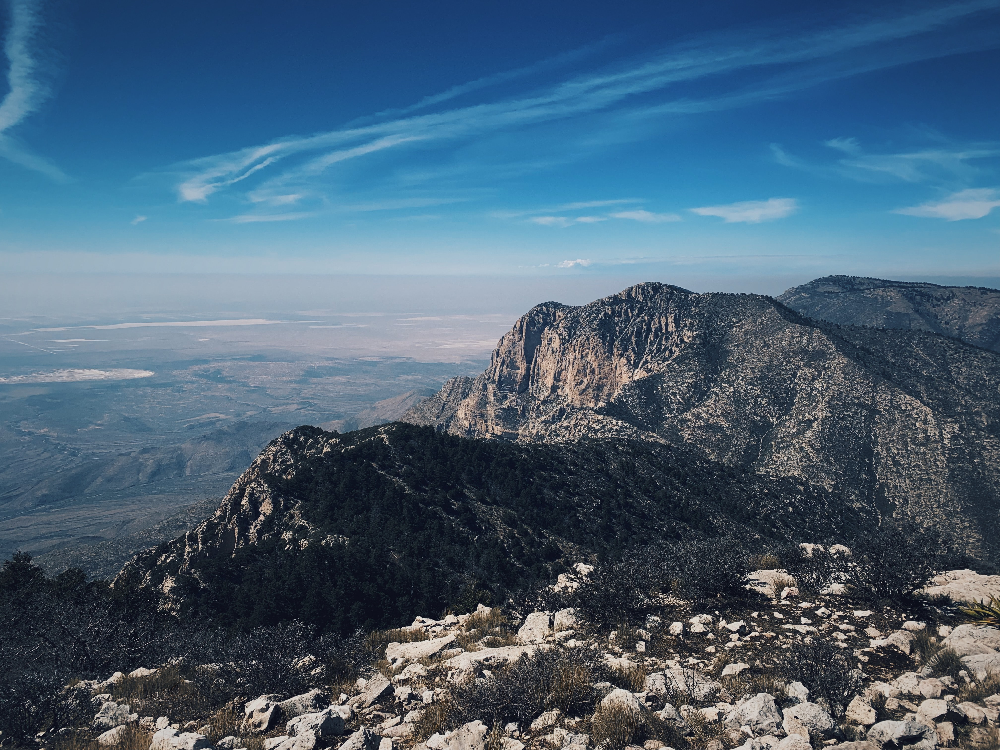

Texas isn't known for its national parks, but the 2 national parks that  Texas does have are incredibly epic and are the best places to visit in Texas.

## What are the national parks in Texas?

**These are the national parks in Texas:**

### 1. Big Bend National Park

### 2. Guadalupe Mountains National Park

