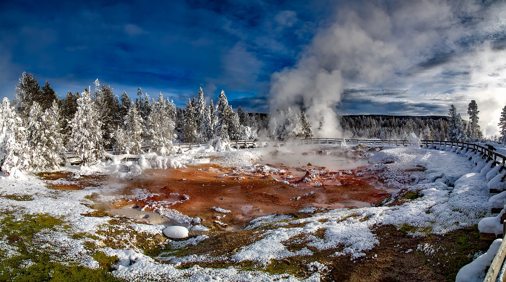

Wyoming is home to the oldest and perhaps the most iconic national park in the world, Yellowstone, which is also one of the best places to visit in Wyoming. In addition to Yellowstone, Wyoming is home to Grand Teton National Park which often gets overlooked because of the hype around Yellowstone.

## What are the national parks in Wyoming?
The national parks in Wyoming are towering mountains, wild herds of roaming bison, and of course vast geyser fields.

The national parks in Wyoming are by far the best places to visit in Wyoming, with Yellowstone being a contender for one of the best places to visit in the entire world. There's really nothing that compares to Yellowstone National Park.

**These are the national parks in Wyoming:**

### 1. Yellowstone National Park

Yellowstone is the oldest national park in the United States and also one of the most popular due to it's totally unique landscape of geysers and thermal pools. Yellowstone is also home to the largest wild buffalo heard in the United States.

### 2. Grand Teton National Park

Grand Teton National Park is home to the majestic Teton Range which dramatically rises above the surrounding landscape. The park is nestled in northwestern Wyoming just less than an hour south of Yellowstone, near Jackson. With over 200 miles of trails, this parks is any hiker's paradise.

